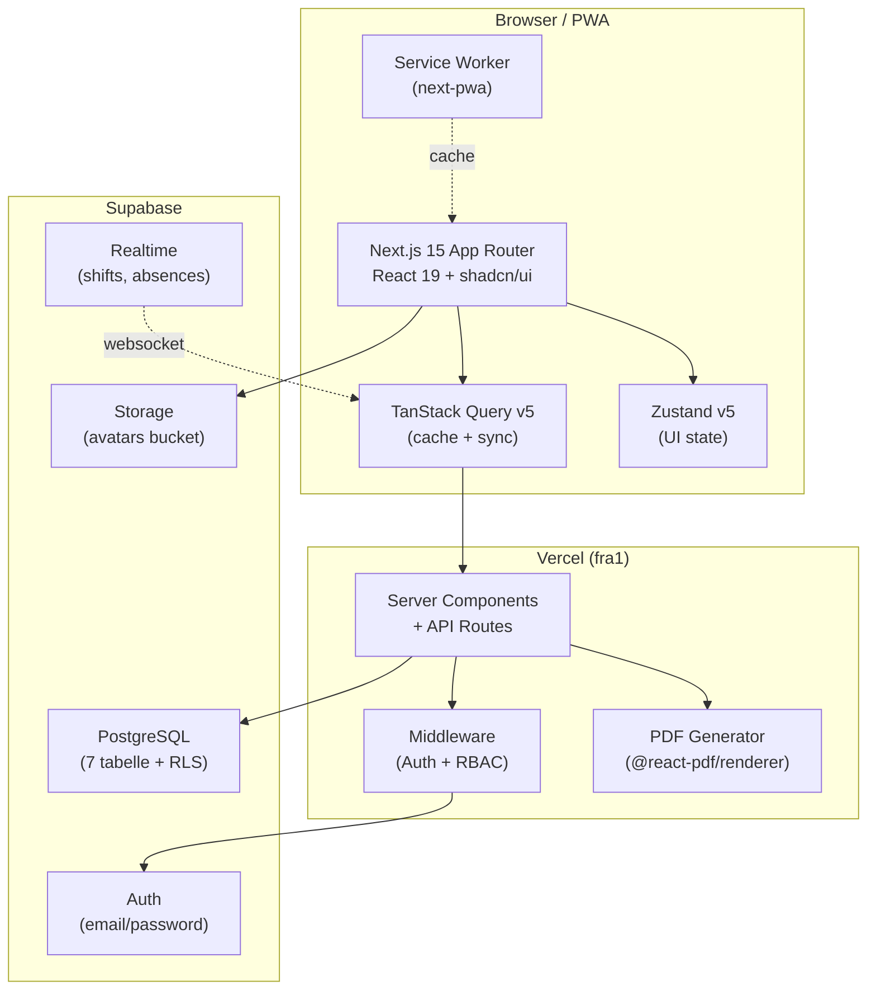
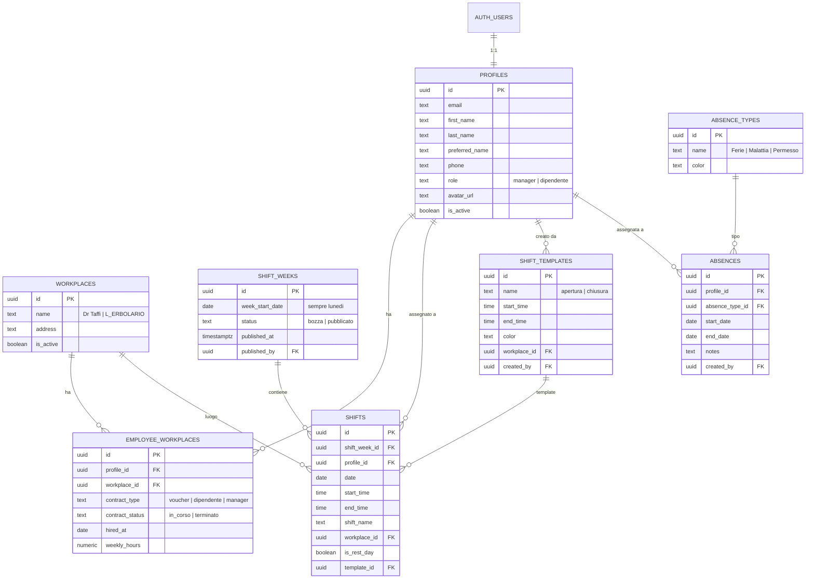
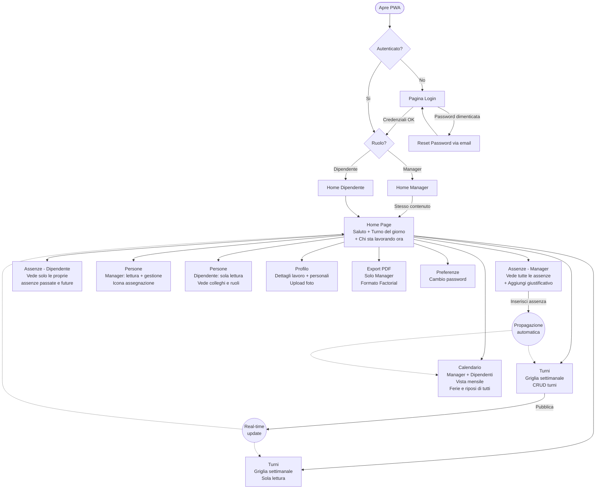
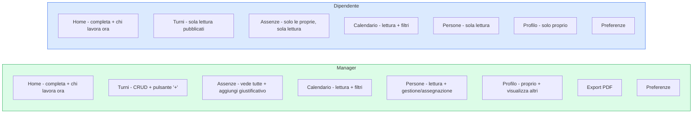

# PRD - Erboristerie d'Italia: PWA Gestione Turni

> **Documento**: Product Requirements Document (PRD)
> **Progetto**: PWA Gestione Turni Dipendenti
> **Cliente**: Erboristerie d'Italia di Muglia Maria Julieta
> **Data**: 2026-04-06
> **Versione**: 1.3
> **Lingua interfaccia**: Italiano

---

## Contesto

"Erboristerie d'Italia di Muglia Maria Julieta" gestisce due negozi - **Dr Taffi** e **L'ERBOLARIO** - con circa 8 dipendenti. Attualmente utilizza Factorial HR per la pianificazione dei turni, la gestione delle assenze e l'anagrafica del personale. **Il costo della licenza Factorial e troppo alto** rispetto alla dimensione dell'azienda (micro-impresa con meno di 10 dipendenti). Non servono funzionalita avanzate come timbratura automatica, community interna, gestione payroll o moduli enterprise.

**Obiettivo**: Creare una PWA privata che replichi fedelmente le funzionalita essenziali di Factorial HR, con interfaccia ispirata a Factorial ma personalizzata con **palette colori verde/natura** coerente con il settore erboristico.

**Design di riferimento**: I mockup nella cartella del progetto sono screenshot di Factorial HR nella versione desktop e rappresentano il design target:
- `Factorial Dipendete/` - Vista dipendente (2 screenshot)
- `factorial foto Manager/` - Vista manager (33 screenshot)
- `valeria a cecchet_full_version_time_tracking_for_marzo_2026_to_marzo_2026 (1).pdf` - Formato export PDF target

---

## 1. Panoramica del Prodotto

### 1.1 Problema
Il costo di Factorial HR e sproporzionato per un'azienda con ~10 utenti che utilizza solo gestione turni, assenze e anagrafica. Il 70% delle funzionalita di Factorial (timbratura, community, posta, temperature, payroll) non viene utilizzato.

### 1.2 Soluzione
PWA privata installabile su desktop e mobile, accessibile tramite URL privato, utilizzabile solo dagli utenti registrati. Replica esclusivamente le funzionalita effettivamente utilizzate.

### 1.3 Target
- **Utenti primari**: Julieta Muglia (Manager/titolare) e un eventuale secondo manager
- **Utenti secondari**: ~6 dipendenti delle due sedi
- **Dispositivi**: Desktop (Fase 1), Mobile (Fase 2)
- **Frequenza d'uso**: Quotidiana per dipendenti (check turno), settimanale intensiva per manager (pianificazione turni)

---

## 2. User Personas

### 2.1 Manager (es. Julieta Muglia)
- **Ruolo**: Titolare, gestisce operativamente 2 punti vendita
- **Obiettivi**: Pianificare turni settimanali in <15 min, gestire assenze, esportare report PDF per il commercialista, gestire anagrafica dipendenti
- **Frustrazioni**: Costo eccessivo Factorial, troppe funzionalita inutili, interfaccia appesantita
- **Competenze tecniche**: Utente medio, sa usare app web e Factorial
- **Frequenza**: Accesso quotidiano per controlli, sessione settimanale 15-30 min per turni, mensile per export PDF

### 2.2 Dipendente (es. Isabella Dolce, Selene Poch)
- **Ruolo**: Commessa/Addetta vendita in una delle due sedi
- **Obiettivi**: Sapere rapidamente il turno di oggi, consultare turni settimanali, aggiornare proprio profilo
- **Frustrazioni**: App complessa solo per sapere "a che ora lavoro oggi"
- **Competenze tecniche**: Utente base, preferisce interfacce semplici
- **Frequenza**: 1-2 volte al giorno per controllare il turno

---

## 3. Funzionalita Core

### 3.1 Must-Have (MVP - Day 1)

#### F01: Autenticazione
| ID | Requisito | Dettaglio |
|----|-----------|-----------|
| F01.1 | Registrazione | Campi: email, password (min 12 caratteri), nome utente, numero di telefono. Utente creato come "Dipendente" di default. Solo Manager promuove a Manager |
| F01.2 | Login | Email + password. Sessione persistente (JWT + refresh token). Redirect a Home |
| F01.3 | Reset password | Flow via email: inserisci email -> link -> nuova password (min 12 caratteri) |
| F01.4 | Logout | Menu foto profilo in basso a sinistra nella sidebar -> "Esci" |
| F01.5 | Protezione rotte | Rotte protette per autenticati. Rotte manager-only per: Turni (edit/creazione), Export, Impostazioni. Rotte condivise (lettura per tutti, gestione solo manager): Calendario, Persone, Assenze (dipendenti vedono le proprie assenze, manager anche aggiunge giustificativi) |

#### F02: Home Page
| ID | Requisito | Dettaglio |
|----|-----------|-----------|
| F02.1 | Saluto personalizzato | "Buongiorno/Buon pomeriggio/Buonasera, [Nome]!" con logica oraria + foto profilo circolare |
| F02.2 | Turno del giorno | Card con: nome turno, orario, luogo di lavoro. Se nessun turno: "Nessun turno assegnato per oggi". Se riposo: "Giorno di riposo" |
| F02.3 | Chi sta lavorando ora | Sezione "Chi sta lavorando adesso" visibile a TUTTI (manager e dipendenti). Mostra la lista dei dipendenti attualmente in turno nell'orario corrente: per ogni persona mostra avatar + nome + orario turno + negozio (es. "Isabella Dolce - 08:30-14:30 - Dr Taffi"). La sezione si aggiorna in base all'ora in cui si visualizza la pagina. Se nessuno sta lavorando: "Nessun dipendente in turno al momento". I dati provengono dai turni pubblicati della settimana corrente, confrontando l'ora attuale con start_time/end_time dei turni del giorno |
| F02.4 | Esclusi | NO timbratura, NO posta, NO community, NO link, NO temperature |

#### F03: Gestione Turni (pagina principale)
| ID | Requisito | Dettaglio |
|----|-----------|-----------|
| F03.1 | Vista settimanale | Griglia: righe=dipendenti, colonne=giorni (Lun-Dom). Colonna sinistra: avatar, nome, ruolo, contatore ore (assegnate/contrattuali), saldo |
| F03.2 | Celle turno | Nome turno + orario + luogo. Sfondo colorato: verde=apertura, giallo=chiusura, rosa=giorno di riposo |
| F03.3 | Turni pre-salvati | Default: "apertura" (08:30-14:30), "chiusura" (14:00-20:00). Click cella vuota -> popup lista turni con ricerca |
| F03.4 | Pianifica turno da zero | Pannello laterale destro: nome, orario inizio/fine, ubicazione (Dr Taffi/L'ERBOLARIO), area lavoro, toggle "Salva turno" con nome + colore etichetta (~10 colori) |
| F03.5 | Giorno di riposo | Menu "+" -> "Aggiungi giorni di riposo". Cella rosa con testo "Giorno di riposo" |
| F03.15 | Pulsante "+" (solo Manager) | In alto a destra, apre un dropdown con 3 opzioni: **"Aggiungi turni"** (selezionando celle sul calendario, apre pannello turni salvati/pianifica da zero), **"Aggiungi giorni di riposo"** (assegna giorno di riposo alle celle selezionate), **"Aggiungi giustificativo"** (apre direttamente lo stesso form/dialog della pagina Assenze per inserire un'assenza senza dover navigare alla pagina Assenze). Il pulsante "+" e visibile SOLO per i Manager |
| F03.6 | Selezione multipla | Click + Ctrl/Shift per selezionare piu celle. Barra azioni: "Cancella selezione", "+", copia, cestino, "Programma", "Pubblica" |
| F03.7 | Stato Bozza/Pubblicato | Badge: pallino arancione "Bozza" / verde "Pubblicato". In bozza i dipendenti NON vedono i turni. Pulsante "Pubblica" rende visibili |
| F03.8 | Filtro luogo di lavoro | Dropdown con checkbox "Dr Taffi" e "L'ERBOLARIO" |
| F03.9 | Filtro dipendente | Icona imbuto -> checkbox per ogni dipendente + "Applica filtri" |
| F03.10 | Aggiungi dipendenti | Link "+ Aggiungi dipendenti" -> dialog con ricerca e checkbox |
| F03.11 | Navigazione temporale | Frecce < > settimana + "Questa settimana" + dropdown "Settimanale" che apre un **mini-calendario mensile** (come da screenshot di riferimento): mostra il mese corrente con griglia lun-dom, le settimane numerate a sinistra (es. "W16 2026"), la settimana corrente evidenziata in turchese/verde. Click su una riga settimana -> naviga a quella settimana. Frecce < > nel mini-calendario per cambiare mese. Si puo navigare fino a fine anno |
| F03.12 | Riga Copertura | In fondo: per ogni giorno icona + "X/Y" (assegnati/totale) |
| F03.13 | Contatore ore | Per dipendente: ore assegnate/contrattuali + saldo (+/-) colorato |
| F03.14 | Vista dipendente | Sola lettura: NO "+", NO selezione, NO modifica. Vede solo turni pubblicati |

#### F04: Assenze (Manager + Dipendenti)
| ID | Requisito | Dettaglio |
|----|-----------|-----------|
| F04.1 | Layout | Due colonne: sinistra=lista giustificativi + storico, destra=calendario annuale 12 mini-calendari. **Visibile a TUTTI** (manager e dipendenti) |
| F04.2 | Vista Dipendente | Il dipendente vede le **proprie** assenze passate e future. Calendario annuale con i propri giorni di assenza evidenziati. Lista storico con i propri giustificativi. **NO pulsante "Aggiungi giustificativo"** |
| F04.3 | Vista Manager | Il manager vede le assenze di **tutti** i dipendenti. Ha il pulsante **"+ Aggiungi giustificativo"** per inserire assenze. Dialog: seleziona dipendente, tipo (Ferie/Malattia/Permesso/ecc.), causa, intervallo date, descrizione. NO flusso richiesta/approvazione - manager inserisce direttamente |
| F04.4 | Propagazione automatica | Assenze appaiono automaticamente nel Calendario mensile e nella vista Turni |
| F04.5 | Storico | Lista cronologica inversa con tipo, date, durata. Divisione per anno. Dipendente: solo le proprie. Manager: tutte |

#### F05: Calendario (Manager + Dipendenti)
| ID | Requisito | Dettaglio |
|----|-----------|-----------|
| F05.1 | Vista mensile | Griglia LUN-DOM, giorno corrente evidenziato, domeniche in rosso. **Visibile a TUTTI** (manager e dipendenti) |
| F05.2 | Barre assenze/riposo | Strisce colorate orizzontali con nome dipendente attraverso i giorni di ferie e di riposo. Sia il dipendente che il manager possono vedere i giorni di ferie e riposo di tutti i colleghi |
| F05.3 | Filtro | Per: luogo di lavoro (Dr Taffi/L'ERBOLARIO), dipendenti (attuali, sotto supervisione, assenti questo mese). Filtri disponibili per tutti gli utenti |

#### F06: Export PDF
| ID | Requisito | Dettaglio |
|----|-----------|-----------|
| F06.1 | Formato | **Identico** al PDF Factorial di riferimento. Colonne: Data, Orario di lavoro, Orario entrata, Orario uscita, Tempo tracciato, Ore lavorate, Saldo positivo, Saldo negativo, Sabato, Domenica |
| F06.2 | Header | Persona giuridica, ID dipendente, nome, titolo professionale, range date |
| F06.3 | Footer | Totali + Ripartizione saldo + Ore aggiuntive + spazio Firma |
| F06.4 | Selezione | Singolo/multipli dipendenti + range date |

#### F07: Persone (Manager + Dipendenti)
| ID | Requisito | Dettaglio |
|----|-----------|-----------|
| F07.1 | Tabella | Colonne: Dipendente (avatar+nome), Titolo professionale, Luogo di lavoro, Data assunzione, Stato accesso, Stato contratto. **Visibile a TUTTI** (manager e dipendenti). Entrambi possono vedere i colleghi, i ruoli e l'organizzazione |
| F07.2 | Filtro | Per luogo di lavoro con checkbox |
| F07.3 | Click riga | Naviga al profilo del dipendente |
| F07.4 | Gestione (solo Manager) | Solo il Manager vede un'icona di gestione (piccola icona ingranaggio/matita) accanto a ogni riga per: assegnare un dipendente a un luogo di lavoro, modificare titolo professionale, cambiare tipo contratto. Il Dipendente vede la tabella in sola lettura senza icone di gestione |

#### F08: Profilo
| ID | Requisito | Dettaglio |
|----|-----------|-----------|
| F08.1 | Dettagli lavoro | Foto profilo caricabile, nome completo, pronomi, **Ruolo** (campo in sola lettura che mostra "Manager" o "Dipendente" a seconda del ruolo dell'utente), email, password. Il primo manager viene inserito manualmente nel database. Il campo Ruolo non e modificabile dall'interfaccia |
| F08.2 | Dettagli personali | Nome, cognome, nome preferito, genere legale |
| F08.3 | Permessi | Ogni utente modifica il proprio profilo (foto, dati personali, password). Manager visualizza (ma non modifica) i profili degli altri dipendenti |

#### F09: Preferenze e Sidebar
| ID | Requisito | Dettaglio |
|----|-----------|-----------|
| F09.1 | Cambio password | Vecchia password + nuova (min 12 caratteri) |
| F09.2 | Sidebar Manager | Home, Turni, Profilo, Calendario, Assenze, Persone, Impostazioni. In basso: foto + nome + "Preferenze"/"Esci" |
| F09.3 | Sidebar Dipendente | Home, Turni (sola lettura), Profilo, Calendario (sola lettura), Assenze (solo proprie, sola lettura), Persone (sola lettura). In basso: foto + nome + "Preferenze"/"Esci" |

### 3.2 Nice-to-Have (Post-Lancio)
| ID | Funzionalita |
|----|-------------|
| N01 | Notifiche push quando turni pubblicati |
| N02 | Turno a rotazione automatico |
| N03 | Programma pubblicazione turni differita |
| N04 | Dashboard Manager con statistiche |
| N05 | Drag & drop turni nella griglia |
| N06 | Duplica settimana turni |
| N07 | UI mobile responsive (bottom-tab navigation) |

### 3.3 Future (Roadmap)
| ID | Funzionalita |
|----|-------------|
| R01 | Flusso richiesta/approvazione ferie da dipendente |
| R02 | Timbratura con geolocalizzazione |
| R03 | Import/Export CSV per migrazione dati |
| R04 | Multi-azienda |
| R05 | Integrazione Google Calendar / Apple Calendar |

---

## 4. User Flow Principale

### 4.1 Manager: Pianificazione turni settimanali
```
Login -> Home (saluto + turno del giorno) -> Sidebar "Turni" ->
Vista settimanale -> [Filtra per negozio] -> Click cella vuota ->
Popup turni salvati (apertura/chiusura) OPPURE "Pianifica da zero" ->
Assegna turno -> Ripeti per ogni dipendente/giorno ->
Controlla Copertura e ore -> Click "Pubblica"
```

### 4.2 Manager: Registrazione assenza
```
Sidebar "Assenze" -> "+ Aggiungi giustificativo" ->
Seleziona dipendente + tipo + cause + date -> "Invia" ->
Assenza visibile in Calendario e Turni automaticamente
```

### 4.3 Manager: Export PDF
```
Sezione Export -> Seleziona dipendenti (checkbox) + range date ->
"Genera PDF" -> Download PDF identico a formato Factorial
```

### 4.4 Dipendente: Controllo turno e navigazione
```
Apre PWA -> [Login se necessario] -> Home: vede subito
"Apertura 08:30-14:30, L'ERBOLARIO" (o "Giorno di riposo") +
sezione "Chi sta lavorando adesso" con colleghi in turno ->
[Opzionale] Sidebar "Turni" -> Vista settimanale sola lettura ->
[Opzionale] Sidebar "Assenze" -> Vede le PROPRIE assenze passate e future (no pulsante aggiungi) ->
[Opzionale] Sidebar "Calendario" -> Vede ferie/riposo di tutti i colleghi ->
[Opzionale] Sidebar "Persone" -> Vede colleghi, ruoli, organizzazione (sola lettura)
```

---

## 5. Linee Guida Design e Colori

### 5.1 Palette Colori Principale

L'interfaccia richiama il mondo delle erboristerie con una palette verde/natura. I colori primari sostituiscono il rosso/rosa di Factorial.

| Ruolo colore | Nome | HEX | Utilizzo |
|-------------|------|-----|----------|
| **Primary** | Verde Erboristeria | `#16a34a` (green-600) | Pulsanti primari, link attivi, voce sidebar attiva, bordo sinistro voce attiva, badge "Pubblicato" |
| **Primary Light** | Verde Chiaro | `#dcfce7` (green-100) | Sfondo voce sidebar attiva, sfondo hover pulsanti, sfondo turno "apertura" |
| **Primary Dark** | Verde Scuro | `#15803d` (green-700) | Testo su sfondo chiaro, hover pulsanti primari |
| **Secondary** | Crema/Beige | `#fefce8` (yellow-50) | Sfondo alternativo sezioni, card sfondo |
| **Accent** | Ambra/Giallo Caldo | `#f59e0b` (amber-500) | Badge "Bozza", avvisi, sfondo turno "chiusura" |
| **Neutral** | Grigio | `#f8fafc` (slate-50) | Sfondo pagina, card form |
| **Neutral Border** | Grigio Bordo | `#e2e8f0` (slate-200) | Bordi tabelle, separatori, bordo sidebar |
| **Text Primary** | Grigio Scuro | `#1e293b` (slate-800) | Testo principale |
| **Text Secondary** | Grigio Medio | `#64748b` (slate-500) | Testo secondario, placeholder, sottotitoli |
| **Danger** | Rosso | `#ef4444` (red-500) | Eliminazione, errori, "Rimuovi foto" |
| **Info** | Turchese | `#06b6d4` (cyan-500) | Barre assenze nel calendario, giorno corrente |

### 5.2 Colori Turni (Etichette)

| Turno | Colore sfondo | Colore testo | HEX sfondo |
|-------|--------------|-------------|------------|
| Apertura (08:30-14:30) | Verde chiaro | Verde scuro | `#bbf7d0` (green-200) |
| Chiusura (14:00-20:00) | Giallo chiaro | Ambra scuro | `#fef08a` (yellow-200) |
| Giorno di riposo | Rosa chiaro | Rosa scuro | `#fce7f3` (pink-100) |
| Turno custom 1 | Arancione chiaro | Arancione scuro | `#fed7aa` (orange-200) |
| Turno custom 2 | Azzurro chiaro | Azzurro scuro | `#bae6fd` (sky-200) |
| Turno custom 3 | Viola chiaro | Viola scuro | `#ddd6fe` (violet-200) |
| Turno custom 4 | Teal chiaro | Teal scuro | `#99f6e4` (teal-200) |

La palette etichette (~10 colori) e selezionabile dal manager quando crea un turno da zero con "Salva turno".

### 5.3 Tipografia

| Elemento | Font | Peso | Dimensione |
|----------|------|------|------------|
| Titoli pagina (h1) | Inter / Geist Sans | Bold (700) | 24px |
| Sottotitoli (h2) | Inter / Geist Sans | Semibold (600) | 18px |
| Testo body | Inter / Geist Sans | Regular (400) | 14px |
| Label form | Inter / Geist Sans | Medium (500) | 14px |
| Testo piccolo | Inter / Geist Sans | Regular (400) | 12px |
| Turno nella cella | Inter / Geist Sans | Medium (500) | 12px |

### 5.4 Componenti UI - Stile

| Componente | Stile |
|-----------|-------|
| **Sidebar** | Sfondo bianco `#ffffff`, bordo destro `#e2e8f0`, larghezza 220px, icone `lucide-react` 20px, voce attiva con bordo sinistro 3px verde + sfondo `#dcfce7` |
| **Pulsanti primari** | Sfondo `#16a34a`, testo bianco, border-radius 8px, padding 8px 16px, hover `#15803d` |
| **Pulsanti secondari** | Bordo `#16a34a`, testo `#16a34a`, sfondo trasparente, hover sfondo `#dcfce7` |
| **Card** | Sfondo bianco, border-radius 12px, shadow `0 1px 3px rgba(0,0,0,0.1)`, padding 16px |
| **Tabelle** | Header sfondo `#f8fafc`, bordi `#e2e8f0`, righe hover sfondo `#f1f5f9`, testo header `#64748b` medium |
| **Input form** | Bordo `#e2e8f0`, border-radius 8px, padding 8px 12px, focus bordo `#16a34a`, sfondo `#ffffff` |
| **Avatar** | Cerchio, bordo 2px `#e2e8f0`, dimensioni: 32px (tabella), 40px (header/home), 120px (profilo) |
| **Badge stato** | Pallino 8px + testo: verde `#16a34a` "Pubblicato" / ambra `#f59e0b` "Bozza" / verde `#16a34a` "in corso" |
| **Dialog/Sheet** | Overlay sfondo `rgba(0,0,0,0.5)`, pannello bianco, border-radius 16px, max-width 480px |

### 5.5 Icone

Libreria: **Lucide React**. Stile: outline, stroke-width 2px, dimensione default 20px.

Icone principali per la sidebar:
- Home: `Home`
- Turni: `Calendar` o `CalendarDays`
- Profilo: `User`
- Calendario: `CalendarRange`
- Assenze: `CalendarOff`
- Persone: `Users`
- Impostazioni: `Settings`
- Preferenze: `SlidersHorizontal`
- Esci: `LogOut`

---

## 6. Requisiti Tecnici

### 6.1 Stack Tecnologico

| Categoria | Tecnologia | Motivazione |
|-----------|-----------|-------------|
| **Framework** | Next.js 15 (App Router) | Integrazione nativa Vercel, React Server Components, middleware per RBAC, API Routes per PDF |
| **UI Components** | shadcn/ui + Tailwind CSS 4 | Componenti copiati nel progetto (personalizzabili), palette verde via CSS variables |
| **State Server** | TanStack Query v5 | Fetch, cache, invalidation, sync real-time con Supabase |
| **State Client** | Zustand v5 | UI state leggero: sidebar, selezione multipla celle, filtri |
| **Database + Auth** | Supabase (PostgreSQL + Auth + Storage) | Richiesto dal cliente |
| **Calendario/Griglia** | CSS Grid custom | La griglia turni Factorial non e un calendario standard, serve custom |
| **Drag & Drop** | @dnd-kit/core v6 | Leggero, accessibile, React-first (per N05 post-lancio) |
| **PDF** | @react-pdf/renderer v4 | Layout dichiarativo JSX, replica esatta tabella Factorial |
| **PWA** | @ducanh2912/next-pwa v5 | Service worker automatico, manifest, installazione su dispositivo |
| **Date** | date-fns v4 | Manipolazione date, locale italiano |
| **Validazione** | Zod v3 | Schema validation form e API |
| **Deploy** | Vercel (region fra1 - Francoforte) | Richiesto dal cliente |
| **Package Manager** | pnpm | Veloce, disk-efficient |

### 6.2 Schema Database Supabase

#### Tabelle principali

```sql
-- profiles: estende auth.users
CREATE TABLE public.profiles (
  id              UUID PRIMARY KEY REFERENCES auth.users(id) ON DELETE CASCADE,
  email           TEXT NOT NULL,
  first_name      TEXT NOT NULL,
  last_name       TEXT NOT NULL,
  preferred_name  TEXT,
  phone           TEXT,
  gender          TEXT CHECK (gender IN ('uomo', 'donna', 'altro')),
  role            TEXT NOT NULL DEFAULT 'dipendente' CHECK (role IN ('manager', 'dipendente')),
  avatar_url      TEXT,
  is_active       BOOLEAN NOT NULL DEFAULT true,
  created_at      TIMESTAMPTZ NOT NULL DEFAULT now(),
  updated_at      TIMESTAMPTZ NOT NULL DEFAULT now()
);

-- workplaces: "Dr Taffi", "L'ERBOLARIO"
CREATE TABLE public.workplaces (
  id          UUID PRIMARY KEY DEFAULT gen_random_uuid(),
  name        TEXT NOT NULL UNIQUE,
  address     TEXT,
  is_active   BOOLEAN NOT NULL DEFAULT true,
  created_at  TIMESTAMPTZ NOT NULL DEFAULT now()
);

-- employee_workplaces: relazione N:N dipendente <-> luogo
CREATE TABLE public.employee_workplaces (
  id            UUID PRIMARY KEY DEFAULT gen_random_uuid(),
  profile_id    UUID NOT NULL REFERENCES public.profiles(id) ON DELETE CASCADE,
  workplace_id  UUID NOT NULL REFERENCES public.workplaces(id) ON DELETE CASCADE,
  contract_type TEXT CHECK (contract_type IN ('voucher', 'dipendente', 'manager')),
  contract_status TEXT NOT NULL DEFAULT 'in_corso',
  hired_at      DATE,
  weekly_hours  NUMERIC(4,1),  -- ore contrattuali settimanali
  created_at    TIMESTAMPTZ NOT NULL DEFAULT now(),
  UNIQUE(profile_id, workplace_id)
);

-- shift_templates: turni salvati ("apertura", "chiusura")
CREATE TABLE public.shift_templates (
  id            UUID PRIMARY KEY DEFAULT gen_random_uuid(),
  name          TEXT NOT NULL,
  start_time    TIME NOT NULL,
  end_time      TIME NOT NULL,
  color         TEXT NOT NULL DEFAULT '#22c55e',
  workplace_id  UUID REFERENCES public.workplaces(id) ON DELETE SET NULL,
  created_by    UUID NOT NULL REFERENCES public.profiles(id),
  is_active     BOOLEAN NOT NULL DEFAULT true,
  created_at    TIMESTAMPTZ NOT NULL DEFAULT now()
);

-- shift_weeks: settimane turni con stato bozza/pubblicato
CREATE TABLE public.shift_weeks (
  id              UUID PRIMARY KEY DEFAULT gen_random_uuid(),
  week_start_date DATE NOT NULL UNIQUE,  -- sempre un lunedi
  status          TEXT NOT NULL DEFAULT 'bozza' CHECK (status IN ('bozza', 'pubblicato')),
  published_at    TIMESTAMPTZ,
  published_by    UUID REFERENCES public.profiles(id),
  created_at      TIMESTAMPTZ NOT NULL DEFAULT now(),
  updated_at      TIMESTAMPTZ NOT NULL DEFAULT now()
);

-- shifts: turni assegnati ai dipendenti
CREATE TABLE public.shifts (
  id              UUID PRIMARY KEY DEFAULT gen_random_uuid(),
  shift_week_id   UUID NOT NULL REFERENCES public.shift_weeks(id) ON DELETE CASCADE,
  profile_id      UUID NOT NULL REFERENCES public.profiles(id) ON DELETE CASCADE,
  date            DATE NOT NULL,
  start_time      TIME,           -- NULL se giorno di riposo
  end_time        TIME,           -- NULL se giorno di riposo
  shift_name      TEXT,
  workplace_id    UUID REFERENCES public.workplaces(id),
  is_rest_day     BOOLEAN NOT NULL DEFAULT false,
  template_id     UUID REFERENCES public.shift_templates(id),
  notes           TEXT,
  created_by      UUID NOT NULL REFERENCES public.profiles(id),
  created_at      TIMESTAMPTZ NOT NULL DEFAULT now(),
  updated_at      TIMESTAMPTZ NOT NULL DEFAULT now()
);

-- absence_types: tipi assenza
CREATE TABLE public.absence_types (
  id          UUID PRIMARY KEY DEFAULT gen_random_uuid(),
  name        TEXT NOT NULL UNIQUE,
  color       TEXT NOT NULL DEFAULT '#06b6d4',
  is_active   BOOLEAN NOT NULL DEFAULT true,
  created_at  TIMESTAMPTZ NOT NULL DEFAULT now()
);

-- absences: assenze/giustificativi
CREATE TABLE public.absences (
  id              UUID PRIMARY KEY DEFAULT gen_random_uuid(),
  profile_id      UUID NOT NULL REFERENCES public.profiles(id) ON DELETE CASCADE,
  absence_type_id UUID NOT NULL REFERENCES public.absence_types(id),
  start_date      DATE NOT NULL,
  end_date        DATE NOT NULL,
  notes           TEXT,
  created_by      UUID NOT NULL REFERENCES public.profiles(id), -- sempre il manager
  created_at      TIMESTAMPTZ NOT NULL DEFAULT now(),
  updated_at      TIMESTAMPTZ NOT NULL DEFAULT now(),
  CHECK (end_date >= start_date)
);
```

#### Row Level Security (RLS)

```sql
-- Helper
CREATE FUNCTION is_manager() RETURNS BOOLEAN AS $$
  SELECT EXISTS (SELECT 1 FROM profiles WHERE id = auth.uid() AND role = 'manager');
$$ LANGUAGE sql SECURITY DEFINER STABLE;

-- Profiles: tutti leggono (per sezione Persone), ognuno aggiorna il proprio, manager aggiorna tutti
-- Shifts: dipendenti vedono solo turni pubblicati, manager CRUD completo
-- Absences: dipendenti leggono le proprie, manager legge tutte. Solo manager inserisce/modifica/elimina
-- Workplaces, shift_templates, absence_types: tutti leggono, solo manager scrive
-- Employee_workplaces: tutti leggono (per Persone), solo manager scrive (assegnazione dipendenti)
```

#### Storage
- Bucket `avatars` (pubblico, 2MB max, JPEG/PNG/WebP)
- Path: `{user_id}/avatar.{ext}`
- Policy: ogni utente carica/aggiorna solo nella propria cartella

### 6.3 Autenticazione

| Flusso | Implementazione |
|--------|----------------|
| **Registrazione** | Form pubblica con email, password, nome utente, telefono -> `supabase.auth.signUp()` -> trigger DB crea record in `profiles` |
| **Login** | `supabase.auth.signInWithPassword()` -> sessione in cookie httpOnly via `@supabase/ssr` |
| **Reset password** | `supabase.auth.resetPasswordForEmail()` -> email con link -> pagina `/auth/reset-password` -> `supabase.auth.updateUser()` |
| **Middleware** | `middleware.ts` verifica sessione su ogni rotta protetta, redirige a `/login` se non autenticato |

### 6.4 Struttura Cartelle Progetto

```
src/
├── app/
│   ├── (auth)/                    # Route group pubbliche
│   │   ├── login/page.tsx
│   │   ├── registrazione/page.tsx
│   │   ├── reset-password/page.tsx
│   │   └── layout.tsx             # Layout centrato senza sidebar
│   ├── (dashboard)/               # Route group protette
│   │   ├── layout.tsx             # Layout con sidebar
│   │   ├── page.tsx               # Home
│   │   ├── turni/page.tsx
│   │   ├── assenze/page.tsx
│   │   ├── calendario/page.tsx
│   │   ├── persone/page.tsx
│   │   ├── profilo/page.tsx
│   │   ├── preferenze/page.tsx
│   │   └── export/page.tsx
│   └── api/
│       ├── shifts/export/route.ts # Generazione PDF
│       └── employees/invite/route.ts
├── components/
│   ├── ui/                        # shadcn/ui
│   ├── layout/                    # sidebar, header
│   └── shared/                    # role-gate, loading, error
├── hooks/                         # use-auth, use-shifts, use-absences, use-realtime
├── lib/
│   ├── supabase/                  # client, server, admin, middleware
│   ├── pdf/                       # Template PDF
│   ├── utils.ts, constants.ts, validations.ts
├── stores/                        # Zustand: ui-store, shift-selection-store
├── types/                         # database.ts (auto-generato), dominio
supabase/
├── migrations/                    # SQL migration files
└── seed.sql
```

### 6.5 Real-time
- Supabase Realtime abilitato su tabelle `shifts`, `shift_weeks`, `absences`
- Subscription via `supabase.channel()` -> invalidazione TanStack Query cache
- Quando manager pubblica turni -> dipendenti vedono aggiornamento immediato

### 6.6 Deploy Vercel
- **Region**: fra1 (Francoforte, piu vicino all'Italia)
- **Environment Variables**: `NEXT_PUBLIC_SUPABASE_URL`, `NEXT_PUBLIC_SUPABASE_ANON_KEY`, `SUPABASE_SERVICE_ROLE_KEY`
- **CI/CD**: Push su `main` -> deploy automatico Production. PR -> deploy Preview
- **Node.js**: 20.x

---

## 7. Rischi e Mitigazioni

| Rischio | Impatto | Mitigazione |
|---------|---------|-------------|
| **PDF non conforme al formato Factorial** | Alto | PDF campione gia nel repo. Confronto pixel-perfect prima del rilascio |
| **Calcolo ore/saldo errato** | Alto | Ore contrattuali configurabili per dipendente. Unit test esaustivi |
| **Differenze UX vs Factorial** | Alto | Replicare fedelmente i flussi Factorial dai mockup. Sessione validazione con Julieta pre-lancio |
| **Migrazione dati da Factorial** | Medio | Import iniziale manuale (8 dipendenti). Oppure export CSV da Factorial |
| **Dipendente non vede turno** | Medio | Home mostra SEMPRE turno del giorno. Se bozza: "Turni non ancora pubblicati" |
| **Password deboli** | Medio | Min 12 caratteri. Rate limiting login (5 tentativi/15 min) |
| **Upload foto malevola** | Medio | Validazione server: solo JPEG/PNG/WebP, max 2MB |
| **Accesso non autorizzato** | Alto | RBAC con RLS su ogni tabella + middleware Next.js |

---

## 8. Metriche di Successo

| Metrica | Target | Misurazione |
|---------|--------|-------------|
| **Registrazione dipendenti** | 8/8 entro 7 giorni | Conteggio utenti DB |
| **Login settimanale dipendenti** | >= 80% almeno 1 login/settimana | Log autenticazione |
| **Tempo pianificazione turni** | <= 15 minuti per settimana completa | Timestamp primo turno -> "Pubblica" |
| **Export PDF mensile** | >= 1 export/mese accettato dal commercialista | Conteggio download PDF |
| **Risparmio costo** | 100% eliminazione costo Factorial | Confronto fatture |
| **Costo hosting** | <= 20 EUR/mese | Fattura Vercel + Supabase (piano free) |
| **Uptime** | >= 99.5% | Health check monitoring |
| **LCP pagina** | <= 2 secondi | Lighthouse |

### Criterio di Successo Finale
Entro 30 giorni dal lancio:
1. Manager ha cessato completamente l'uso di Factorial
2. Tutti i dipendenti consultano turni solo tramite PWA
3. Almeno 1 ciclo export PDF accettato dal commercialista
4. Zero segnalazioni di turno non visibile

---

## 9. Piano di Implementazione

### Fase 1: Fondamenta (Settimana 1-2)
- Setup progetto Next.js 15 + Supabase + Vercel
- Schema database + migrazioni + RLS
- Autenticazione (registrazione, login, reset password)
- Layout globale con sidebar (Manager/Dipendente)
- Pagina Home con saluto + turno del giorno

### Fase 2: Turni - Core (Settimana 3-4)
- Griglia turni settimanale
- Turni pre-salvati + pianifica da zero
- Giorni di riposo
- Filtri (luogo di lavoro, dipendente)
- Navigazione temporale
- Stato Bozza/Pubblicato
- Selezione multipla celle
- Contatori ore + Riga Copertura
- Vista dipendente (sola lettura)
- Real-time: pubblicazione turni -> aggiornamento dipendenti

### Fase 3: Assenze + Calendario (Settimana 5)
- Pagina Assenze (calendario annuale + storico + aggiungi giustificativo)
- Pagina Calendario (vista mensile + barre assenze + filtri)
- Propagazione automatica assenze -> Turni e Calendario

### Fase 4: Persone + Profilo + Export (Settimana 6)
- Pagina Persone (tabella anagrafica + filtro negozio)
- Pagina Profilo (dettagli lavoro + personali + upload foto)
- Pagina Preferenze (cambio password)
- Export PDF (formato identico a Factorial)

### Fase 5: Polish + Test + Deploy (Settimana 7)
- Palette verde/natura su tutta la UI
- PWA manifest + service worker
- Test E2E con Playwright
- Sessione di validazione con Julieta
- Deploy produzione su Vercel
- Seed dati reali (8 dipendenti, 2 negozi, turni tipo)

---

## 10. Diagramma Architetturale (Mermaid)

### 10.1 Architettura di Sistema



### 10.2 Schema Entita Database (ER)



### 10.3 User Flow - Navigazione Completa



### 10.4 Permessi per Ruolo



---

## Verifica

Per verificare che l'implementazione sia corretta:

1. **Auth**: Registrare un utente, fare login, reset password, verificare che il dipendente non veda Export/Impostazioni
2. **Turni**: Creare turni per una settimana, usare turni pre-salvati e da zero, selezione multipla, pubblicare e verificare che il dipendente li veda
3. **Home - Chi sta lavorando ora**: Assegnare turni nell'orario corrente, verificare che la sezione "Chi sta lavorando adesso" mostri i dipendenti in turno con nome e negozio, sia dal profilo manager che dipendente
4. **Assenze (manager)**: Inserire un'assenza dal manager, verificare che appaia nel Calendario e nella vista Turni
5. **Assenze (dipendente)**: Verificare che il dipendente veda solo le proprie assenze passate/future, senza pulsante "Aggiungi giustificativo"
6. **Assenze da Turni**: Verificare che il pulsante "+" nella pagina Turni -> "Aggiungi giustificativo" apra lo stesso form della pagina Assenze
7. **Calendario (dipendente)**: Verificare che il dipendente veda il Calendario con ferie e riposi di tutti i colleghi
8. **Navigazione settimane**: Verificare che il dropdown "Settimanale" nei Turni apra un mini-calendario con settimane numerate e navigazione per mese
9. **Persone (dipendente)**: Verificare che il dipendente veda la lista persone in sola lettura (senza icone gestione). Verificare che il manager veda l'icona di gestione per assegnare dipendenti
10. **Export PDF**: Generare un PDF per un dipendente su un mese e confrontarlo visivamente con il PDF Factorial di riferimento nel repo
11. **Profilo**: Caricare una foto profilo, modificare dati personali, cambiare password
12. **Real-time**: Aprire la PWA come dipendente, pubblicare turni come manager da un'altra sessione, verificare aggiornamento immediato
13. **PWA**: Verificare installabilita su desktop (Chrome "Installa app")
